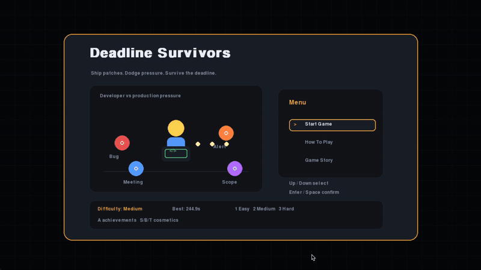
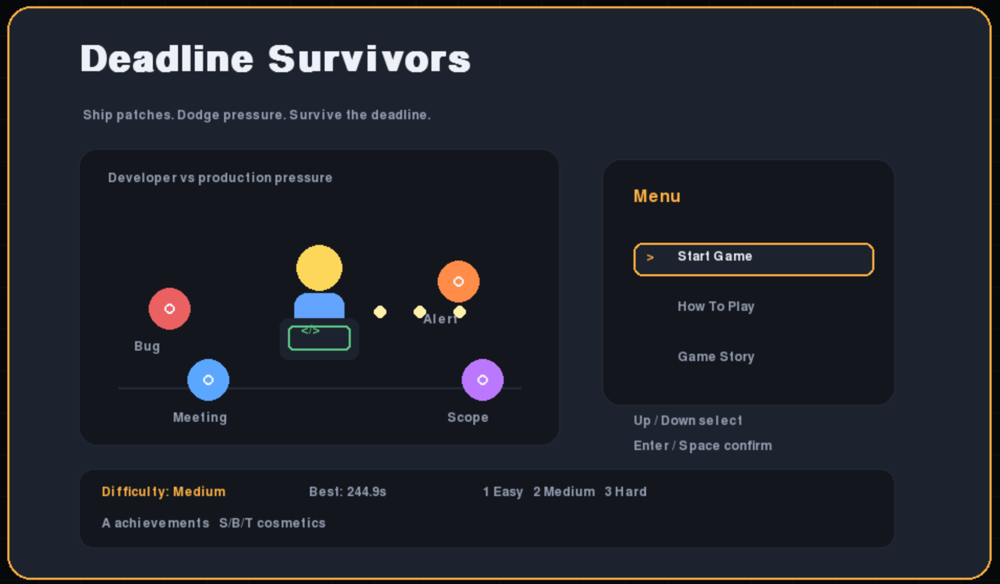
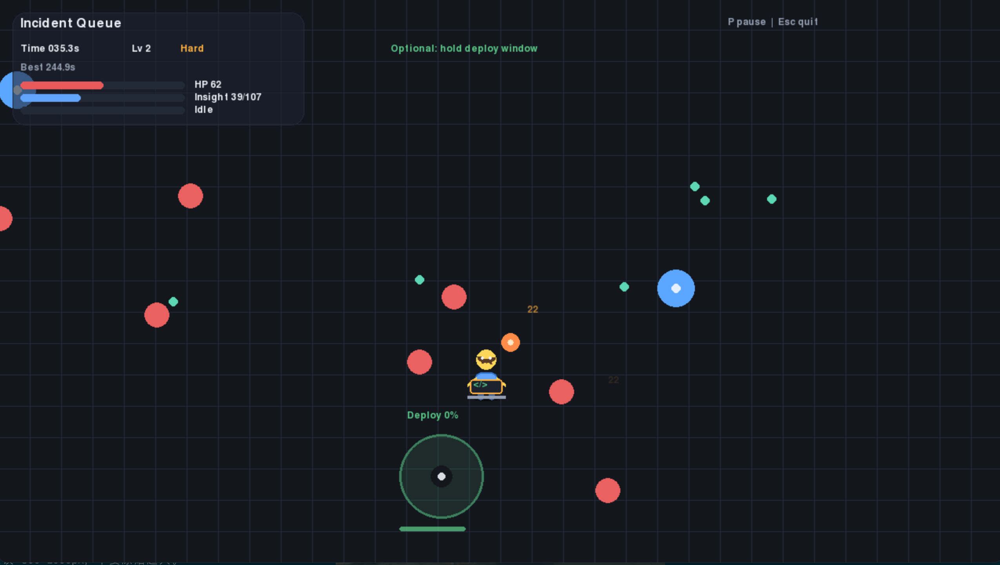
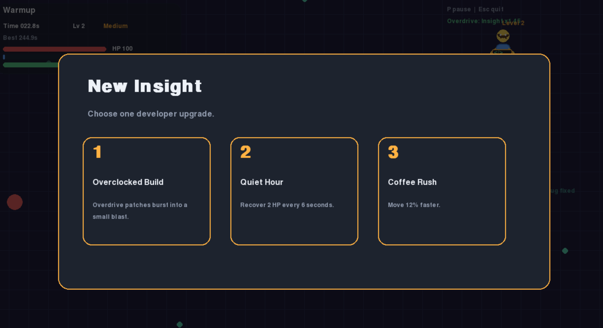
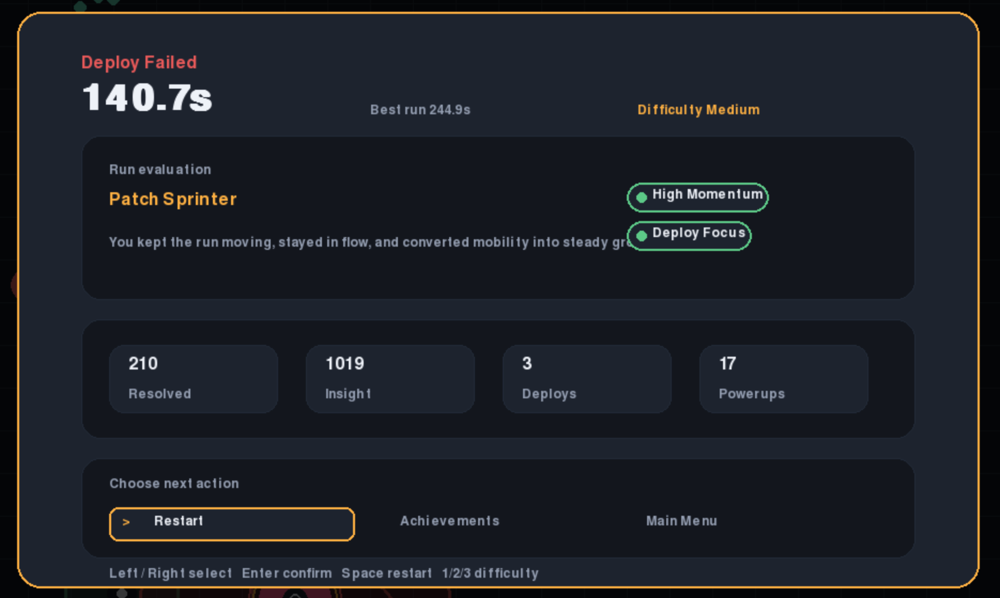

# Deadline Survivors

[](https://github.com/yl0711-coder/deadline-survivors/actions/workflows/build.yml)
[](https://github.com/yl0711-coder/deadline-survivors/releases/latest)
[](pyproject.toml)

A tiny local arcade survival game about shipping patches while bugs, meetings, alerts, and production outages close in.

No server. No account. No telemetry. Download a zip, unzip it, and play locally.

## Why Try It

- Fast to start: choose a difficulty and survive a short run.
- Developer-themed enemies: Bugs, Meetings, Alerts, Scope Creep, Deadlines, and Production Outages.
- Run variety: upgrades, powerups, deploy windows, achievements, badges, skins, local history, and options.
- Desktop friendly: packaged builds for Windows, macOS Intel, macOS Apple Silicon, and Linux.
- Open source: built with Python and `pygame-ce`, with tests, linting, targeted type checks, CI, and release packaging.

## Demo



## Screenshots

| Title | Gameplay |
| --- | --- |
|  |  |

| Upgrade | Game Over |
| --- | --- |
|  |  |

## Play

The easiest way to play is through the itch.io page:

- [Download Deadline Survivors on itch.io](https://yl0711.itch.io/deadline-survivors)

You can also download zip packages from the [latest GitHub Release](https://github.com/yl0711-coder/deadline-survivors/releases/latest):

- `deadline-survivors-windows.zip`
- `deadline-survivors-macos-intel.zip`
- `deadline-survivors-macos-apple-silicon.zip`
- `deadline-survivors-linux.zip`

Intel Macs should use the Intel package. Apple Silicon Macs should use the Apple Silicon package.

If your browser or operating system warns that the app is from an unidentified developer, that is expected for an unsigned open-source build. The game does not need network access and stores settings, achievements, and run history locally.

## Run From Source

```bash
python3 -m venv .venv
source .venv/bin/activate
pip install -r requirements.txt
python3 run_game.py
```

Windows PowerShell:

```powershell
py -m venv .venv
.venv\Scripts\Activate.ps1
pip install -r requirements.txt
py run_game.py
```

## Controls

- `WASD` or arrow keys: move
- `Enter` / `Space`: confirm menu actions
- `1`, `2`, `3`: choose difficulty or level-up upgrades
- `A`: achievements
- `H`: local run history
- `O`: options
- `B`: cycle badges
- `S`: cycle player skins
- `T`: cycle patch themes
- `P`: pause / resume
- `Esc`: close menus or quit

## Gameplay

- Keep moving to avoid enemies and deadline zones.
- Patches fire automatically at nearby threats.
- Collect insight shards to level up.
- Choose upgrades to shape the current run.
- Grab Coffee Breaks, Refactor Bombs, and CI Boosts when they drop.
- Capture Deploy Windows for bonus insight, healing, and Focus Mode.
- Build Momentum by moving; high Momentum improves patching and pickup flow.
- Prioritize Production Outages before they flood the map with hazards and support enemies.
- Review your last 10 completed runs locally with `H`.
- Use `O` to toggle sound, toggle floating text, or clear local save data.

## Project Notes

The game uses:

- `pygame-ce` for windowing, input, rendering, audio, and timing
- `PyInstaller` for Windows, macOS, and Linux packages
- GitHub Actions for tests, packaged binary smoke tests, and release zips
- `ruff` for lightweight linting
- `mypy` for targeted type checks on pure rule and factory modules

For details:

- [MANUAL.md](MANUAL.md): full player and maintainer guide
- [ARCHITECTURE.md](ARCHITECTURE.md): code structure and refactoring rules
- [README.zh-CN.md](README.zh-CN.md): Chinese README

## Feedback

Issues and gameplay feedback are welcome:

- [itch.io page](https://yl0711.itch.io/deadline-survivors)
- [Report a bug](https://github.com/yl0711-coder/deadline-survivors/issues/new)
- [View releases](https://github.com/yl0711-coder/deadline-survivors/releases)
- [Source repository](https://github.com/yl0711-coder/deadline-survivors)
